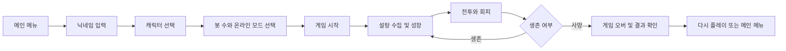

# SUGAR RUSH 게임 소개 문서

> Grow Sweet. Fight Hard.
>
> 본 문서는 SUGAR RUSH의 게임 개요, 플레이 방식, 게임 환경, 시스템 구조를 설명하기 위한 문서 골조입니다. 실제 기능과 기획 의도를 함께 정리하고, 향후 상세 기획서와 사용자 안내서로 확장할 수 있도록 구성했습니다.

## 1. 게임 한눈에 보기

### 1.1 게임명

- 정식 명칭: SUGAR RUSH
- 장르: 실시간 아레나 PvP 성장 액션 게임
- 핵심 문구: Grow Sweet. Fight Hard.
- 플레이 인원: 싱글 플레이 기반 봇 대전, 선택형 온라인 멀티플레이
- 플랫폼: 데스크톱 브라우저, 모바일 브라우저

### 1.2 한 줄 소개

플레이어는 디저트 캐릭터를 조작해 맵 곳곳의 설탕을 먹고 성장하며, 다른 플레이어와 봇을 공격하고 생존하는 실시간 아레나 게임을 플레이합니다.

### 1.3 핵심 재미

- 설탕을 먹을수록 커지고 강해지는 성장감
- 성장할수록 현상금과 위험도도 증가하는 위험-보상 구조
- 서로 다른 역할을 가진 디저트 캐릭터 선택
- 실시간 공격, 회피, 추격, 근접 전투
- 핫 존과 파워업을 활용한 전장 내 위치 선정
- 모바일과 데스크톱에서 서로 다른 조작 방식 제공

## 2. 게임 목표

### 2.1 기본 목표

- 맵에 생성되는 설탕을 수집해 자원과 점수를 확보합니다.
- 캐릭터의 성장 수치를 높이고 전투에서 우위를 만듭니다.
- 다른 플레이어와 봇을 처치해 킬과 현상금 보상을 얻습니다.
- 사망하기 전까지 최대한 오래 생존하고 높은 점수를 기록합니다.

### 2.2 승리 기준

현재 버전은 단일 라운드 생존과 점수 경쟁을 중심으로 합니다.

- 생존 시간
- 누적 점수
- 보유 설탕
- 처치 수
- 획득 현상금

> [확장 예정] 라운드 종료 조건, 최종 순위 산정 방식, 시즌/랭크 시스템을 이곳에 구체화합니다.

## 3. 플레이 흐름



### 3.1 시작 전 설정

1. 닉네임을 입력합니다.
2. 캐릭터를 선택합니다.
3. 봇 수를 선택합니다.
4. 필요하면 `ONLINE MODE`를 활성화합니다.
5. 게임을 시작합니다.

### 3.2 게임 중 행동

1. 캐릭터를 이동합니다.
2. 주변 설탕을 수집합니다.
3. 성장한 캐릭터로 적을 공격합니다.
4. 파워업과 핫 존을 선택적으로 활용합니다.
5. 위험도가 높아지면 추격과 생존 사이에서 판단합니다.

### 3.3 사망 후

- 플레이어가 사망하면 결과 화면으로 이동합니다.
- 봇은 일정 시간 후 안전한 위치에서 부활합니다.
- 사망한 캐릭터가 보유하던 설탕 일부는 맵에 드롭됩니다.
- 결과 화면에서 점수, 보유 설탕, 킬 수, 생존 시간을 확인할 수 있습니다.

## 4. 조작 방법

### 4.1 데스크톱

| 동작 | 조작 |
| --- | --- |
| 이동 | `WASD` 또는 방향키 |
| 조준 | 마우스 이동 |
| 기본 공격 | 마우스 왼쪽 버튼 누르기 |
| 고유 능력 | `SPACE` |
| 일시정지 | `ESC` |
| 성능 디버그 화면 | `F2` |

### 4.2 모바일

- 왼쪽 아날로그 조이스틱: 이동
- 오른쪽 아날로그 조이스틱: 조준 및 공격
- 번개 버튼: 고유 능력 사용
- 일시정지 버튼: 게임 일시정지

모바일 조작은 터치 드래그를 기반으로 하며, 조이스틱의 방향과 거리에 따라 이동 방향과 세기가 결정됩니다.

> [확장 예정] 모바일 제스처, 진동 피드백, 접근성 옵션을 추가로 정리합니다.

## 5. 캐릭터 소개

### 5.1 Cookie

- 역할: 밸런스형 / 입문자 친화
- 기본 능력: Cookie Shield
- 특징: 보호막과 안정적인 전투 능력
- 추천 플레이: 생존과 공격을 균형 있게 운영

### 5.2 Candy

- 역할: 스피드 / 암살
- 기본 능력: Sugar Dash
- 특징: 빠른 이동과 짧은 무적 대시
- 추천 플레이: 적의 측면을 파고들고 빠르게 이탈

### 5.3 Pudding

- 역할: 탱커 / 근접 브롤러
- 기본 능력: Pudding Slam
- 특징: 넓은 범위의 근접 공격과 강한 넉백
- 추천 플레이: 근접 교전과 다수전에서 압박

### 5.4 Donut

- 역할: 차지형 저격 / 순간 폭발
- 기본 능력: Sugar Hole Blast
- 특징: 공격을 충전해 강력한 투사체와 범위 공격 사용
- 추천 플레이: 거리를 유지하며 타이밍을 잡아 공격

> [확장 예정] 캐릭터별 수치표, 상성, 추천 빌드, 숙련도별 운영법을 추가합니다.

## 6. 성장 시스템

### 6.1 설탕 수집

맵에는 다음 설탕 아이템이 생성됩니다.

| 종류 | 기능 | 특징 |
| --- | --- | --- |
| Sugar Cube | 기본 자원 획득 | 가장 일반적인 설탕 |
| Candy | 중간 자원 획득 | 기본 설탕보다 높은 가치 |
| Donut Hole | 높은 자원 획득 | 전투 중 성장에 유리 |
| Golden Sugar | 대량 자원과 점수 | 희귀하고 높은 보상 |
| Rainbow Sugar | 일시적 획득 배율 증가 | 일정 시간 설탕 획득량 증가 |
| Toxic Sugar | 자원 획득과 HP 손실 | 높은 보상과 위험을 동시에 제공 |

### 6.2 성장 효과

설탕을 보유하면 캐릭터의 다음 요소가 성장합니다.

- 캐릭터 크기
- 최대 HP
- 공격력
- 현상금

성장 효과는 선형이 아닌 완만한 로그 기반으로 적용되어, 초반 성장은 빠르고 후반 성장은 점진적으로 진행됩니다.

### 6.3 설탕 감소와 위험도

일정량 이상의 설탕을 보유하면 시간이 지남에 따라 설탕이 감소합니다.

- 500 미만: 감소 없음
- 500 이상: 단계별 설탕 감소
- 설탕이 많을수록 현상금과 위험도가 증가

이 시스템은 많이 먹는 것이 항상 안전한 선택은 아니도록 설계되어 있습니다.

## 7. 전투 시스템

### 7.1 기본 공격

캐릭터별 공격 방식이 다릅니다.

- Cookie: 기본 투사체 공격
- Candy: 빠른 투사체 공격
- Pudding: 3단계 근접 콤보 공격
- Donut: 차지 시간에 따른 강화 투사체 공격

### 7.2 고유 능력

각 캐릭터는 쿨다운 기반의 고유 능력을 사용합니다.

- Cookie: 방어막과 피해 감소
- Candy: 대시와 짧은 무적
- Pudding: 광역 슬램과 넉백
- Donut: 주변 적을 밀어내는 범위 폭발

### 7.3 전투 보조 요소

- HP와 지연 HP 바
- 보호막
- 속도 증가
- 공격력 증가
- 부활 무적 시간
- 피격 플래시와 공격 피드백
- 투사체와 범위 공격

## 8. 맵과 환경

### 8.1 월드

- 월드 크기: `3000 x 3000`
- 장애물: 캔디 블록, 마시멜로, 젤리 벽
- 카메라: 플레이어 추적형, 줌아웃 시야 지원
- 화면: 월드 좌표를 Canvas 화면 좌표로 변환해 렌더링

### 8.2 핫 존

핫 존은 일정 시간마다 위치가 바뀌는 고위험 지역입니다.

- 핫 존 내부에서 추가 보상 기회 제공
- 일정 시간마다 HP 감소
- 이동 경고와 위치 변경
- 핫 존 이동 시 특수 설탕 생성

### 8.3 파워업

맵에는 다음 파워업이 생성됩니다.

- Heal: HP 회복
- Shield: 일정 시간 보호막
- Speed: 이동 속도 증가
- Damage: 공격력 증가

## 9. 봇과 싱글 플레이 환경

봇은 플레이어와 동일한 맵에서 설탕을 수집하고 전투합니다. 봇마다 행동 성향이 다릅니다.

- Collector: 설탕과 파워업 중심
- Hunter: 적 추적과 처치 중심
- Coward: 위험 회피와 생존 중심
- Aggressive: 적극적인 근접 교전
- Balanced: 상황에 따른 균형형 행동

봇 AI는 매 프레임 전체 판단을 수행하지 않고, 일정 주기의 의사결정과 매 프레임 이동을 분리해 성능 부담을 줄이는 구조입니다.

## 10. 온라인 멀티플레이

### 10.1 동작 방식

온라인 모드에서는 브라우저 클라이언트와 WebSocket 릴레이 서버가 연결됩니다.

- 플레이어 상태 전송
- 원격 플레이어 위치와 체력 동기화
- 투사체 이벤트 전달
- 공격 적중 이벤트 전달
- 점수 기준 순위 계산

현재 구조는 클라이언트 게임 엔진을 중심으로 동작하고, 서버는 접속 플레이어 상태와 이벤트를 중계하는 MVP 형태입니다.

> [확장 예정] 서버 권위 판정, 치팅 방지, 지연 보상, 재접속, 방 매칭, 서버 장애 복구를 강화합니다.

### 10.2 멀티플레이 실행

터미널 1:

```bash
npm install
npm run dev
```

터미널 2:

```bash
npm run multiplayer
```

브라우저에서 `http://localhost:3000/`에 접속한 뒤 메인 메뉴에서 `ONLINE MODE`를 활성화합니다.

기본 WebSocket 포트:

- `3001`
- 환경 변수 `WS_PORT` 또는 `PORT`로 변경 가능

프로덕션 WebSocket 주소 지정 예시:

```bash
VITE_WS_URL=wss://your-game.example.com/multiplayer npm run build
```

## 11. 기술 환경

### 11.1 클라이언트

- React
- TypeScript
- Vite
- HTML Canvas 2D
- Tailwind CSS
- Lucide React
- Web Audio API

### 11.2 서버

- Node.js
- TypeScript 실행기 `tsx`
- WebSocket 라이브러리 `ws`
- Express 기반 프로젝트 환경

### 11.3 주요 모듈

| 모듈 | 책임 |
| --- | --- |
| `GameEngine` | 게임 루프, 입력, 전투, 충돌, 렌더링 흐름 |
| `Camera` | 월드-화면 좌표 변환과 카메라 추적 |
| `SugarManager` | 설탕 생성, 수집, 드롭, 공간 그리드 |
| `ParticleSystem` | 파티클, 부유 텍스트, 이펙트 풀링 |
| `BotAI` | 봇 의사결정, 이동, 공격, 성향 |
| `MultiplayerClient` | WebSocket 연결과 원격 상태 수신 |
| `audio` | Web Audio API 기반 효과음 |
| `HUD` | 핵심 수치와 게임 상태 UI |
| `GameCanvas` | Canvas와 데스크톱/모바일 입력 처리 |

## 12. 성능 및 호환성 전략

현재 게임은 다양한 접속 환경에서 품질 편차를 줄이기 위해 다음 전략을 사용합니다.

- Canvas 내부 렌더링 픽셀 예산 제한
- 고DPI 기기에서 과도한 내부 해상도 방지
- 파티클 최대 개수 제한
- 파티클 풀링을 통한 객체 재사용
- 설탕 수집 공간 그리드 기반 검색
- 봇 AI 의사결정 주기 분리
- 모바일 아날로그 입력 지원
- 카메라 줌아웃으로 시야 확보
- 불필요한 HUD와 미니맵 제거

> [확장 예정] 실제 기기별 FPS 표, 배터리 사용량, 네트워크 지연 기준, 품질 프리셋을 추가합니다.

## 13. 설치 및 실행

### 13.1 요구 사항

- Node.js
- npm
- 최신 Chrome, Edge, Firefox 또는 Safari 계열 브라우저
- 모바일 플레이 시 터치 입력을 지원하는 브라우저

### 13.2 기본 실행

```bash
npm install
npm run dev
```

브라우저 주소:

```text
http://localhost:3000/
```

### 13.3 타입 검사와 프로덕션 빌드

```bash
npm run lint
npm run build
```

## 14. 현재 버전의 범위와 제한

### 포함된 기능

- 싱글 플레이 봇 대전
- 선택형 WebSocket 멀티플레이
- 4종 캐릭터
- 설탕 성장과 감소
- 공격, 능력, 파워업, 핫 존
- 데스크톱과 모바일 조작
- 파티클 및 오디오 피드백
- 게임 오버 결과 화면

### 현재 제한

- 서버 권위형 게임 판정이 아님
- 계정, 저장, 시즌, 랭크 시스템 없음
- 정교한 매칭과 방 관리 없음
- 네트워크 지연 보정이 제한적임
- 브라우저 성능과 네트워크 환경에 따라 체감 품질이 달라질 수 있음

## 15. 향후 개발 방향

### 단기

- 모바일 기기별 입력 감도 설정
- 성능 프리셋 선택 기능
- 게임 내 튜토리얼과 초보자 안내
- 전투 피드백과 사운드 밸런스 조정
- 멀티플레이 접속 상태 표시

### 중기

- 서버 권위형 판정
- 매칭과 방 시스템
- 캐릭터 밸런스 및 신규 캐릭터
- 맵 변형과 신규 핫 존 규칙
- 리플레이와 전투 통계

### 장기

- 계정과 진행도 저장
- 시즌 랭크와 리더보드
- 커스텀 게임 모드
- 관전자 모드
- PWA 또는 패키지 앱 배포

## 16. 문서 확장용 메모

- [ ] 게임 핵심 루프 다이어그램 보완
- [ ] 캐릭터별 상세 수치표 작성
- [ ] 초보자용 5분 플레이 가이드 작성
- [ ] 모바일 조작 이미지 또는 GIF 추가
- [ ] 멀티플레이 네트워크 구조도 추가
- [ ] 성능 테스트 기기 목록과 결과 추가
- [ ] 스크린샷 및 플레이 영상 추가
- [ ] 배포 환경별 설정 정리

## 17. 스크린샷 및 소개 자료 영역

> [추가 예정]
>
> - 메인 메뉴 이미지
> - 실제 게임 플레이 이미지
> - 모바일 조작 이미지
> - 캐릭터 선택 화면
> - 게임 오버 결과 화면
> - 멀티플레이 장면
